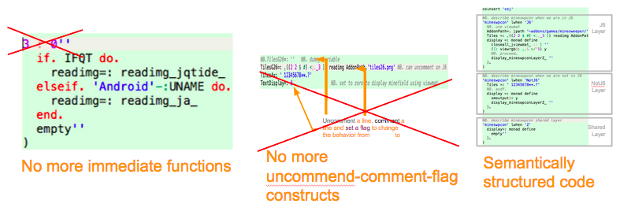

This work was done by Bastian Kruck as part of the COP seminar at HPI in winter term 2014 / 2015.

# COJ

- COJ is an assignment-based layer-in-class COP Framework for J
- it works with activation-time lookup
- no call-time overhead
- build in userland without VM modifications
- state: prototype
- with COJ, you can replace immediate functions and smelling constructs with semantically structured code
 

# Folders
- proposal1: seminar proposal on COJ
- proposal2: seminar proposal on COPenv
- survey: Asking the chat mailinglist about "Modularity in J". The three answers are contained
- journal: the export of my unstructured notes, my lab journal so to say
- fast forward: the result of the first demo implementation for the proof of concept
- source: the projects source code
    - source/layer.ijs contains the first implementation that worked with locale switching only
    - source/layer2.ijs contains the current coj api and core methods
    - source/utils.ijs implements the syntax and helper functions for layer and layer2

# Links
- Survey:         https://docs.google.com/forms/d/17lJk-6KjyhNs9WDPtuVn-_cEPU1O6NpQW2IDo5ER9m8/viewform
- Survey Results: https://docs.google.com/spreadsheets/d/1tDaXXlaukIJeu-a2dz0sDFcAkLQkmo6bdI4ofRfjkn0/edit?usp=sharing
